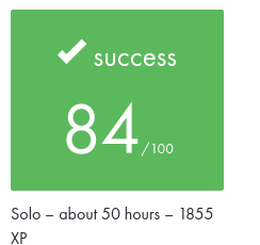

# Academic Project Context

This document preserves the academic provenance of the original **push_swap**
project while the repository root documents the current maintained portfolio
edition.

## 42 Common Core

| | |
| --- | --- |
| **Project** | `push_swap` |
| **Curriculum** | 42 Common Core |
| **Development mode** | Solo |
| **Final evaluation** | **84/100** |
| **Approximate workload** | 50 hours |
| **XP** | 1855 XP |
| **Supplied subject reference** | Version 10.1 |

## Evaluation record

The supplied 42 Intra record shows a final evaluation of **84/100**.

The project is recorded as a **solo** project with an approximate workload of
**50 hours** and **1855 XP**.

The image above is a privacy-conscious crop of the original evaluation record.
Evaluator identities, evaluator comments, private repository information,
account-identifying information, and unnecessary platform navigation are not
included.

## Subject provenance

The documentary subject supplied during the portfolio review identifies itself
as:

> **Push_swap, Version 10.1**

The subject PDF itself is intentionally not redistributed in this repository.

Because 42 subjects can change over time, Version 10.1 is recorded as the
supplied documentary reference. It is not presented as independently proving
the exact subject revision used on the original evaluation date.

The supplied subject describes a two-stack sorting problem in which the
`push_swap` program must generate a valid sequence of stack operations while
keeping the operation count within evaluation benchmarks.

## Academic scope

The original academic project required the mandatory `push_swap` program.

Its central goals included:

- parsing and validating integer input;
- manipulating two stacks using the allowed instruction set;
- producing a valid sorting sequence;
- minimizing the number of generated operations;
- reasoning about algorithmic complexity and sorting strategies;
- respecting the project's C, Makefile, memory-management, and error-handling
  constraints.

The supplied subject also documents an optional `checker` bonus program.

The academic evaluation result recorded here is **84/100** and should be read
as the historical project result, independently from later portfolio
maintenance.

## AI usage during academic development

AI assistance was used during the original academic development as a learning,
design, and review aid.

Its role included activities such as:

- clarifying algorithmic and complexity concepts;
- understanding and comparing sorting approaches;
- understanding binary radix sorting;
- reasoning about project structure and implementation design;
- reviewing ideas and implementation decisions;
- brainstorming alternatives and receiving feedback.

AI was not treated as a substitute for understanding the project or as a
source of a complete implementation to copy into the repository.

## Maintained portfolio edition

The current `main` branch is a later maintained portfolio edition.

Post-project engineering work includes repository modernization, dependency
management, automated testing, CI, documentation, validation, and other
maintainability improvements.

AI assistance has also been used more extensively during this later
modernization phase for activities such as:

- repository and source-code audits;
- maintainability review;
- parser and error-path hardening support;
- regression-test design;
- CI and GitHub workflow support;
- dependency modernization;
- Doxygen and documentation work;
- validation procedures;
- cross-repository portfolio consistency.

AI-assisted suggestions were reviewed against the actual implementation and
validated before integration.

## Historical preservation

The immutable tag:

`portfolio-baseline-2026-09`

preserves the repository state immediately before the structured professional
portfolio modernization.

The maintained release:

`v1.0.0`

represents the first completed portfolio release.

These references preserve the distinction between historical academic work and
the later maintained repository.
